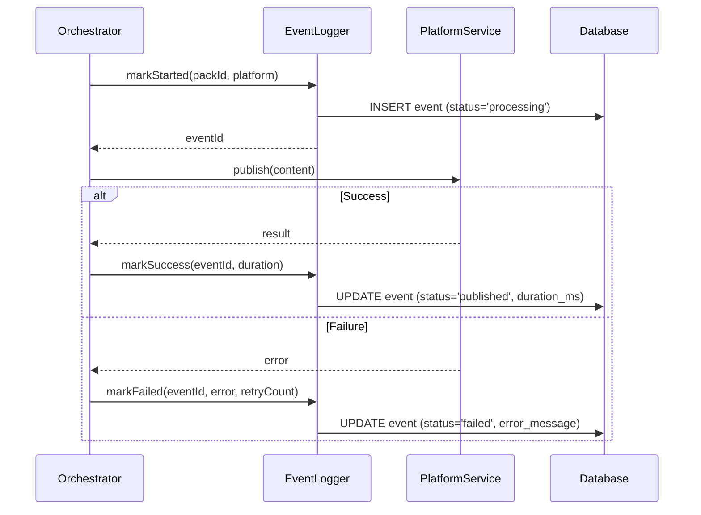

# Publishing Analytics Integration

**Task 3 Complete**: Event logging integrated into Publishing Orchestrator

## Changes Made

The Publishing Orchestrator now automatically tracks all publishing events to the `publishing_events` table for analytics purposes.

## Integration Points

### 1. Publishing Event Lifecycle

Every publishing attempt is now logged with the following lifecycle:

```
START → PROCESSING → [SUCCESS or FAILURE]
```

### 2. Tracked Data

For each publishing attempt, we track:
- **pack_id**: Content pack being published
- **platform**: Target platform (twitter, linkedin, etc.)
- **status**: Current status (processing, published, failed)
- **started_at**: When publishing began
- **completed_at**: When publishing finished
- **duration_ms**: Time taken in milliseconds
- **error_message**: Error details if failed
- **retry_count**: Number of retry attempts

### 3. Modified Code

**File**: `apps/api/src/services/publishing/orchestrator.ts`

**Changes**:
1. Import `publishingEventLogger` from analytics service
2. Added event logging to `processPublishingJob` method:
   - Log start with `markStarted()`
   - Track start time
   - Log success with `markSuccess(duration)` on successful publish
   - Log failure with `markFailed(error, retryCount)` on error

## Usage Example

When publishing a content pack, events are automatically logged:

```typescript
const orchestrator = new PublishingOrchestrator()

// This will automatically log events to publishing_events table
await orchestrator.publishPack(packId, ['twitter', 'linkedin'], content)
```

**Database Records Created**:
```sql
-- For Twitter publish
INSERT INTO publishing_events (
  pack_id,
  platform,
  status,
  started_at,
  completed_at,
  duration_ms
) VALUES (
  'pack-123',
  'twitter',
  'published',
  '2025-01-15 10:00:00',
  '2025-01-15 10:00:02.5',
  2500
);

-- For LinkedIn publish
INSERT INTO publishing_events (
  pack_id,
  platform,
  status,
  started_at,
  completed_at,
  duration_ms
) VALUES (
  'pack-123',
  'linkedin',
  'published',
  '2025-01-15 10:00:00',
  '2025-01-15 10:00:03.2',
  3200
);
```

## Event Flow



## Error Handling

Event logging failures are non-blocking - if logging fails, publishing continues:

```typescript
try {
  const eventId = await publishingEventLogger.markStarted(packId, platform)
  // ... publishing logic
  await publishingEventLogger.markSuccess(eventId, duration)
} catch (error) {
  // Publishing error is thrown, but logging error is caught
  await publishingEventLogger.markFailed(eventId, error.message, retryCount)
  throw error // Original error propagates
}
```

## Retry Tracking

When jobs are retried, the `retry_count` is automatically tracked:

```typescript
// First attempt
retry_count: 0

// After first retry
retry_count: 1

// After second retry
retry_count: 2
```

## Benefits

1. **Audit Trail**: Complete history of all publishing attempts
2. **Performance Metrics**: Accurate timing data for each platform
3. **Error Analysis**: Detailed error messages for debugging
4. **Success Rates**: Calculate success/failure rates per platform
5. **Analytics Dashboard**: Powers the analytics dashboard (Tasks 5-25)

## Next Steps

- Task 4: Create daily aggregation job to populate `publishing_daily_metrics`
- Tasks 5-8: Create analytics query services
- Tasks 9-12: Create REST API endpoints
- Tasks 13-25: Build analytics dashboard UI

## Verification

To verify event logging is working:

```sql
-- Check recent events
SELECT * FROM publishing_events
ORDER BY created_at DESC
LIMIT 10;

-- Check success rate
SELECT
  platform,
  COUNT(*) as total,
  COUNT(*) FILTER (WHERE status = 'published') as successful,
  ROUND(COUNT(*) FILTER (WHERE status = 'published')::DECIMAL / COUNT(*) * 100, 2) as success_rate
FROM publishing_events
GROUP BY platform;

-- Check average duration by platform
SELECT
  platform,
  ROUND(AVG(duration_ms)) as avg_duration_ms,
  ROUND(AVG(duration_ms) / 1000.0, 2) as avg_duration_seconds
FROM publishing_events
WHERE status = 'published'
GROUP BY platform
ORDER BY avg_duration_ms;
```

## Testing

To test the integration:

```bash
# 1. Run migration
pnpm --filter @cm/api run migrate

# 2. Publish a test content pack
curl -X POST http://localhost:3001/api/publishing/publish \
  -H "Content-Type: application/json" \
  -d '{
    "pack_id": "test-pack",
    "platforms": ["twitter"],
    "content": {"text": "Test post"}
  }'

# 3. Check events were logged
psql $DATABASE_URL -c "SELECT * FROM publishing_events WHERE pack_id = 'test-pack';"
```

## Monitoring

Monitor event logging with these queries:

```sql
-- Events logged today
SELECT COUNT(*) FROM publishing_events
WHERE DATE(created_at) = CURRENT_DATE;

-- Failed publishes today
SELECT platform, error_message, COUNT(*)
FROM publishing_events
WHERE status = 'failed' AND DATE(created_at) = CURRENT_DATE
GROUP BY platform, error_message;

-- Slowest publishes today
SELECT pack_id, platform, duration_ms
FROM publishing_events
WHERE status = 'published' AND DATE(created_at) = CURRENT_DATE
ORDER BY duration_ms DESC
LIMIT 10;
```
